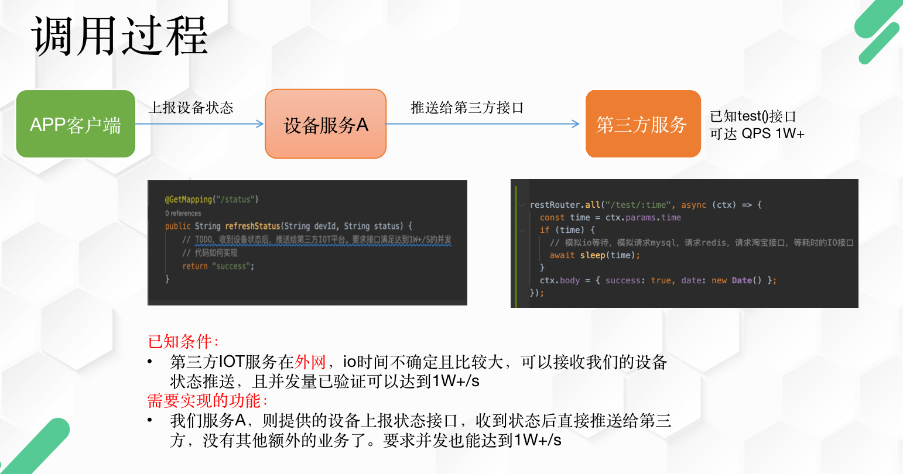

## 一、内容背景

看过我第一篇文章的同学应该都知道，线程池的存在的一些小问题，实际上如果不追求性能的极致，一般多线程都能解决问题。但是线程池的最大线程数的计算问题，以及部分IO时间占比太大导致线程数量太多，都不好解决优化。所以我们来看看NIO模式是怎么解决这些问题，NIO是如何无视IO时间，做到吞吐量几乎保持不变。

相信很多小伙伴对服务器进行过压力测试，但是有时候不同的测试方案，会有不同的测试结果。这一篇文章将会非常的精彩，告诉大家性能测试中各种坑，如何正确的进行压测，分别对多线程模型的服务和NIO模型的服务进行测试，以及如何优化自己的服务接口，废话不啰嗦，直接上。

## 二、内容目录

    测试NIO的服务
    测试多线程模型服务
    Java的NIO服务
    如何优化我们的服务
    总结

## 三、测试NIO模型服务
首先我们先进行NIO服务的压力测试，为什么呢？主要是想给大家看到NIO服务的吞吐量是如何无视IO时间的。这也是我们第一个结论，我们先带着这个结论去看测试结果。

使用的是nodejs中的koa2框架，比较简单方便。贴出部分代码，业务逻辑很简单，通过请求参数time来模拟业务中的IO时间，比如请mysql，请求redis，或者请求外部淘宝接口等，这些都是耗时的IO。

```
// 模拟io等待时间
async function sleep(time) {
  return new Promise((resolve) => {
    setTimeout(() => {
      resolve();
    }, time || 1000);
  });
}

// 测试IO对吞吐量的影响
restRouter.all("/test/:time", async (ctx) => {
  const time = ctx.params.time
  if (time) {
    // 模拟io等待
    await sleep(time);
  }
  // 消耗单线程的CPU时间，把性能下降到一定位置，这样方便测试IO的对性能的影响
  for (let i = 0; i < 700; i++) {
    ("tokentest" + i).match(/^token.*$/g);
  }
  if (count++ % 1000 == 0) {
    console.log(ctx.url, count);
  }
  ctx.body = { success: true, date: new Date() };
});

```
测试的前提：
- 首先http客户端机器的性能必须接近或者大于服务端机器的接口性能，你总不能用一台树莓派去压测I7服务器的性能吧？不少的人可能会忽略这一点。（通常实际有业务接口的服务中，普通的机器作为客户端完全没问题。如果要压测没有业务的服务端，那就需要注意这点）
- 确保客户端不会率先出现瓶颈。如果无法确认，可以拿客户端去压测Nginx，看看客户端的极限性能在哪里。从压测nginx的服务来看，一个nodejs客户端在800个连接，测试的qps=8000，，当然实际还远远未到nginx的性能。也就是说一个nginx的客户端是完全可以压测到8000的并发的。

> 主要是为了控制连接数这变量对于客户端性能影响的问题，如果连接数很大会导致客户端需要吃更多的cpu（实际几千个到没啥压力），造成自身的并发能力下降，就误以为连接数导致服务接口性能也下降。

> 而且客户端和服务器都在同一个机器上，客户端消耗太多的cpu，就会影响到服务端的接口性能，那么就不容易得到服务器接口真实的水平，就会影响我们验证IO和连接、和吞吐量的关系。这个为了测试的相对严谨可控。


测试的方案：
1. 在不同IO时间下，测试吞吐量QPS跟http客户端连接数关系。

>一般会用吞吐量这个专业名词，代表着单位时间能处理的请求数是多少，我们先设定单位是s秒。

1、测试的服务器就是4核心，CPU E5-2682 v4 @ 2.50GHz

2、测试的客户端机器也是同一台机器，由于在同一台服务器上，会有一定cpu竞争影响，所以都对同一个参数下测试了3次，另外nodejs基本是单线程模型，主要是消耗单核cpu，客户端也是采用nodejs来压测，所以4核心足够了。

>首先设置io时间为20ms，也就是请求 “/test/20”，客户端连接数分别为100，200，400，800，1600，2400，请求总次数为2w次(次数越多越准确)。QPS等于请求总次数除以请求总时间。

|      | 100 | 200 | 400 | 800 | 1600 | 2400  |
| -----| -----| ---- | ---- |---- | ---- | ---- |
| 20ms| 3030 | 4080 | 4530 | 4620 | 4650 | 4640 |
| 50ms | 1720 | 3100 | 4150 | 4610 | 4660 |4620 |
| 100ms | 962 | 1830 | 3150 | 4110 | 4620 |4580 |
| 200ms | 473 | 954 | 1860 | 3120 | 4030 | 4510 |

> 这里的每组数据测试均压测了3次，取最高的值。

3、从上面的结果，大家能得出多个结论呢？
 1. 首先可以得到的是连接数在不断增加后，吞吐量会有明显增加。尤其是当io时间为200ms，连接数100，200，400，吞吐量相应的跟着翻了一倍（这是为啥？）。
 2. 在最佳连接数1600的时候，几个IO时间的吞吐量都比较接近。只有200ms是在2400达到最大，后续单独测试3200个连接，qps在4580左右。可以看到出来吞吐量并没有因为io时间长短而发生大幅衰减，有一点下降，但是不明显（不排除客户端影响的）。

4、测试过程中：
 1. 另外在测试的时候有观察服务端的连接数和CPU使用情况。
  1. 在连接数比较少的时候，服务端和客户端都没有跑满一个cpu核心100%的性能（nodejs主要是单线程模型），所以要得到应用服务的最大性能值，通常连接数是一个关键指标.

### 小结：
这里主要是跟大家分享的几个结论：
 1. NIO基本不会因为业务IO时间的长短而影响吞吐量，再次强调是吞吐量，因为就算使用了NIO，它`不会`让你的接口响应时间`变快`，它相对多线程编程，能够轻松的跑到`最高的吞吐量`了，而不需要因为IO时间长短去调整优化线程的数量，还要强调并不是NIO就一定比多线程的吞吐量高，通过调整线程数一样可以得到高吞吐量，只是NIO的编程模型使得它能更好的利用cpu。
 2. 刚刚哪个问题：一个当io时间为200ms，连接数100，200，400，吞吐量基本同时翻了一倍（这是为啥）。这里非常非常的关键，那就是http协议的问题，因为http一个连接每次请求只有等到响应之后，才可以发起下一次请求（无法同时发起多次请求），它是`一问一答`。那么一个http连接，它在接口响应时间为200ms的情况下，一秒最多不超过5次的请求和响应，可以得出100个连接中，qps不会超过500/s。同理200个连接，也不会超过1000/s，400个连接，不会超过2000/s。这个信息是非常的关键，几乎没有小伙伴能get到这样的信息。在实际项目开发中，很多都会忽视连接数这个概念（应该就是http连接池的同理）。所以http2的出现就是为了解决这个问题，单个连接可以同时进行请求和响应，这一点在后续可以进行测试。
 3.从这里可以得到一个http客户端（NIO客户端）是很容易并发几千上万个请求的，如果在互联网中，你需要请求微信或者淘宝的一些接口，瓶颈应该只会在网络带宽上，跟接口响应的IO时长没关系，刚才已经验证了。

综上所得一个非常影响吞吐量的因素，那就是连接数，由于没有多路复用，连接数有可能会成为瓶颈，NIO在http面前也不是绝对的万能，这个是协议的问题。比如微服务中出现性能瓶颈，虽然几乎都是业务问题，但是也存在是连接数的问题（连接池大小）。

>其实从http连接的特性，可以很清晰的看到，多线程的编程模型是多么符合这个特性，一条线程对应一个连接是非常简单易懂的编程模型，它们天生就是一对绝配。客户端的话用这样的模型就挺好的，但是服务端由于连接数比较多不太适合。

## 四、测试多线程模型的服务

上面已经讲了NIO模型的服务是如何无视IO时间，保持稳定的吞吐量。下面会给大家分享多线程的情况下，线程数，IO时间和吞吐量关系，这个比较简单。

同样测试的前提：

1. 请参考上面的情况，需要客户端性能大于服务端的性能，这样才能压测出相对真实的性能情况。
2. 确保客户端的连接大于tomcat线程数，否则会出现线程空闲的情况，大于多少呢？如果是1：1的情况下，会出现什么情况呢？当A连接在A线程处理完后拿到响应后，再发起下一次请求，而这个网络等待的IO过时间里，会出现A线程空闲的情况，建议连接数量大于线程数即可，因为tomcat8.0（或undertow）是服务端是NIO模型，即使几倍于线程数都没问题。

## 测试方案：

 1. 由于连接数跟线程数几乎是对应的关系，所以连接数这个变量变得不那么重要了，所以连接数固定就好。重要的是线程数，这里简单的做一下IO时间跟线程数的测试结果.
 2. 固定http连接数2000，分别测试IO为20ms，50ms，100ms，200ms，tomcat线程数在20，100，200，500，800的情况。
 
 > 客户端的连接数保持2000，是因为本次测试中我们的线程数最大为800，连接数最好能大于线程数几倍，也符合我们正常的服务访问。tomcat本身支持NIO，所以没有问题。

 ```

    @RequestMapping("/test/{time}")
    public String test(@PathVariable("time") int time) throws InterruptedException {
        System.out.println("----test------" + System.currentTimeMillis());
        // log对性能测试影响还是挺大 已经通过异步写入日志解决了 
        // log.info("---test--:", time ); 
        if (time > 0) {
            Thread.sleep(time);
        }
        return "hello world";
    }

 ```

### 测试结果

|       | 20   | 100  | 200   | 400   | 800     | 1000  |
| ----- | -----| ---- | ----  | ----  | ----    | ---- |
| 20ms  | 960  | 4680 | 9000+ | 12000+ | 12000+ | 12000+ |
| 50ms  | 368  | 1930 | 3790  | 7000+  | 12000+ | 12000+ |
| 100ms | 190  | 975  | 1900  | 3760   | 7000+  | 9000+ |
| 200ms | 92   | 455  | 960   | 1859   | 3750   | 4510 |


启动springboot服务，这里同样模拟IO的时间，其实已经没有多大的意义了。这里我相信大部分同学都能明白这些IO时间越长，线程数量就必须越多，才能达到最大的并发。

## Java的NIO服务测试

刚才我们说过tomcat（undertow）不是支持NIO吗？不是说NIO可以无视IO时间，也可以达到最大的吞吐量吗？那为什么刚才的springboot测试不行呢？接下来就是我们整个课程最重要的一个知识点了，也是大部分java开发关注需要知道的知识点，也是我今天主要想讲解的地方。

我们的业务需求是这样的。现在有一个设备服务需要在收到设备新的状态后，同步给第三方平台。并且要求这个接口也能达到1W+的并发。请问怎么处理？



因为我们大部分情况下是使用同步代码开发，遇到IO的时候，线程就会阻塞，所以就必须要大量的线程来处理IO这部分的业务代码。但其实servlet是有支持异步方案的，也有异步的api实现的，我们看看代码的实现。


### 传统的代码实现：

```
    @RequestMapping("/testBlock/{time}")
    public String testBlock(@PathVariable("time") int time) throws Exception {
        System.out.println("-----testAsync------" + System.currentTimeMillis());
        String url = "http://127.0.0.1:7080/test/" + time;
        String res = HttpClientUtil.get(url, null);
        return res;
    }


```

### 异步代码实现：

```

@RequestMapping("/testAsync/{time}")
    public void testAsync(@PathVariable("time") int time, HttpServletRequest req) throws Exception {
        System.out.println("-----testAsync------" + System.currentTimeMillis());
        String url = "http://127.0.0.1:7080/test/" + time;
        // String res = HttpClientUtil.get(url, null);
        final AsyncContext ctx = req.startAsync();
        VertxHttpClientUtil.getClient().post(url, (data) -> {
            try {
                ctx.getResponse().getWriter().print(data);
                // 这是必须要执行的complete
                ctx.complete();
            } catch (IOException e) {
                e.printStackTrace();
            }
        });
    }

```

> 问题：上面的业务代码就是类似调用微服务，或者调用redis，mysql等一些IO操作。如果这些IO非常的长，那么会不会影响我们的这个/testAsync/{time} 接口的吞吐量呢？


基于上面的代码，我们在简单测试一下。可以知道在最大线程数为20的情况下，不管nodejs:7080这个服务器的响应时间是多少，都不会影响java服务的吞吐量，这就是NIO优势了，其实就这样简单。如果是用传统的代码调用方式，nodejs服务如果响应时间在200ms，那么java的 /testAsync/{time} 接口则需要2000+个tomcat线程，才能做到1W的并发，当然连接数也要同时跟进2000+。

测试结果：

|       | 20   |  50  |
| ----- | -----|  -----|  
| 20ms  | 7200 | 7300 |  
| 50ms  | 7100  | 7400 |  
| 100ms | 6900  | 7100 |  
| 200ms | 6800  | 7200 |  

这个结果也是在预料之中的，这个吞吐量只有7000+的原因，由于都在同一台机器上运行2个服务，客户端也在同一台机器上运行，springboot也增加了httpclient请求代码，导致cpu互相竞争，所以每次测试的结果会有所差异。

不过我们测试的时候，条件都是相同的（每次测试都是在同一台服务器上进行）， 所以也有意义。至少说明java的NIO服务几乎无视IO时间，依然保持相同水平的吞吐量。

回到异步和同步的问题：

刚才的那个测试，就是一个微服务调用的测试，假设下游服务响应时间过长，就会严重的阻塞了tomcat的线程，不仅仅导致自己的接口吞吐量降低，也会导致其他的接口无法得到线程来处理，整个服务的吞吐量的降低。并不是机器的性能不行，是IO时间太长了，线程数不够，但是你又没有办法动态的去调整tomcat线程数，还是得重启。另外调用第三方接口，走外网的访问，IO时间更加长。

在讲java NIO之前有一个问题，那就是java微服务中的RPC实现是使用NIO的，有用吗？？我们先不用考虑这个nio是使用哪个框架（或者哪种协议）去实现的，我们只要考虑一个问题，如果你的业务层是使用同步代码，意味着必有一个地方实现了异步转同步，因为基于NIO的RPC框架必然存在异步处理的问题。

目前我只知道可以通过多线程去把异步转同步，大家可以去找相关的代码实现。而线程池一定会有一个问题，就是io时间不确定，且当IO时间过长，就需要大量的线程数量来满足吞吐量。而且到了代码层来后，你的tomcat线程依然会进行阻塞，依旧无解。

核心问题在于java目前还不支持协程，虽然阿里，华为都是相关的jvm实现，但至少官方不支持，openjdk也还在开发中。

### 异步RPC的问题
如果说在springboot上的微服务，使用同步代码进行rpc-nio调用是没有意义的（即使这个RPC使用NIO框架实现），等于绕了一圈回到多线程上来。
除非你使用springboot的异步编程，或者使用webflux响应式编程，vert.x 异步编程。这样才能完全使用上NIO的优势。

> 下面这种方式，我不管你的HttpClientUtil是请求http接口，还是mysql，redis等的请求，只要是同步代码，必然会阻塞当前的tomcat线程的。阻塞了tomcat线程，那么必然导致tomcat线程需要设置很大，才能满足并发量。

```
    @RequestMapping("/testBlock/{time}")
    public String testBlock(@PathVariable("time") int time) throws Exception {
        System.out.println("-----testAsync------" + System.currentTimeMillis());
        String url = "http://127.0.0.1:7080/test/" + time;
        String res = HttpClientUtil.get(url, null);
        return res;
    }


```

## NIO的劣势

讲了NIO的绝对优势后，我们简单看看NIO有啥劣势？

其实刚才的代码就体现了异步编程的问题。这是个非常头大的问题，业务代码非常的难实现。核心问题在于java目前还不支持协程，虽然阿里，华为都是相关的jvm实现，但至少官方不支持，openjdk也还在开发中。


## 总结
前面讲述了NIO服务可以几乎无视的IO时间，依旧保持相同水平的吞吐量。但是仍然还有连接数的这个关键的因素，影响着吞吐量的大小，当然这个是跟客户端有关系了。

NIO带来的异步编程是非常麻烦的，下一篇文章会详细讲解异步编程带来的问题，看看地狱回调的噩梦，以及响应式编程的魔幻逻辑，还有终极解决方案-协程。